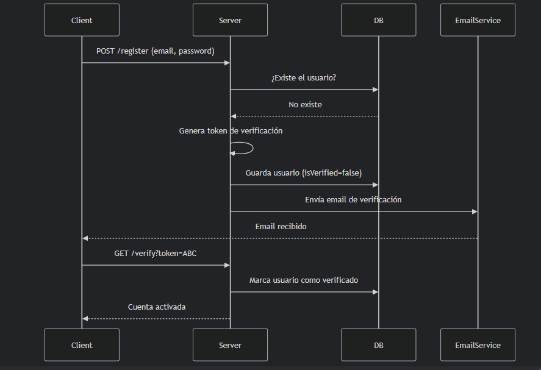

<head> 
<style type="text/css">
    strong { background-color: #ff0; }
    * { font-family: monospace; }
</style>


### Tabla de Contenido
- [Tabla de Contenido](#tabla-de-contenido)
- [Paso 1. Importaciones Básicas.](#paso-1-importaciones-básicas)
- [Paso 2. Inicializaciones de Express.](#paso-2-inicializaciones-de-express)
- [Paso 3. Ruta de Prueba.](#paso-3-ruta-de-prueba)
- [Paso 4. Arrancar el Servidor.](#paso-4-arrancar-el-servidor)
- [Paso 5. Conexión a MongoDB + Primer Modelo (User).](#paso-5-conexión-a-mongodb--primer-modelo-user)
- [Flujo Completo de Registro/Login Mejorado](#flujo-completo-de-registrologin-mejorado)
- [📌 Endpoints de Productos](#-endpoints-de-productos)
- [📌 Endpoints de Autenticación](#-endpoints-de-autenticación)
- [📌 Endpoints de Pedidos(Orders)](#-endpoints-de-pedidosorders)
- [📌 Endpoints de reembolsos(return)](#-endpoints-de-reembolsosreturn)

----------
### Paso 1. Importaciones Básicas.
[Volver](#tabla-de-contenido)

1. Instala <strong>express</strong> y <strong>mongoose</strong> en tu proyecto de Node.js. Recuerda instalar mongoose en tu proyecto de Node.js, además instala los <strong>tipos de express y mongoose como dependencias de desarrollo. </strong>

2. Escribe las primeras lineas de tu <strong>app.ts</strong> con las importaciones necesarias.


```console
npm install express mongoose dotenv
npm install --save-dev @types/express @types/mongoose @types/dotenv
```
----------

### Paso 2. Inicializaciones de Express.
[Volver](#tabla-de-contenido)

1. Crea un archivo llamado **app.ts** en la carpeta **src** y agrega el siguiente contenido:

```typescript

import express from 'express';
import { Request, Response } from 'express';
import { config } from 'dotenv';
// Para versiones de express anteriores a 4.16, 
// ya express se exportaba de manera predeterminada
import bodyParser from 'body-parser';


config();

const app = express();

// Parsear JSON
// Para versiones superiores o iguales a 4.16,
app.use(express.json());

//Parsear JSON
//Para versiones anteriores a 4.16,
//app.use(bodyParser.json());

app.get('/', (req: Request, res: Response) => {
    res.send('Hello World!');
})

app.listen(3000, () => {
    console.log('Example app listening on port 3000!');
})


```

<details>
<summary><strong>Retos</strong></summary>
<ol>
    <li>Crea una instancia de express.✅</li>
    <li>Crea una instancia de dotenv.✅</li>
    <li>Asigna el puerto 3000 al servidor.✅</li>
    <li>Crea un endpoint que responda con un mensaje de bienvenida.✅</li>
    <li>Ejecuta el servidor en el puerto 3000.✅</li>
    <li>Añade el middleware para parsear JSON.✅</li>
</ol>
</details>


----------

### Paso 3. Ruta de Prueba.
[Volver](#tabla-de-contenido)

**Tarea:**

Implementa la siguiente ruta: 
```typescript

GET / -> { 
    message: "API funcionando", 
    data: { version: "1.0.0", timestamp: new Date().toISOString() } 
    }

```

**Preguntas para reflexionar:**

<details>
<summary>¿Cómo defines una ruta GET en Express?</summary>
<strong>Respuesta:</strong></br>
Una ruta GET en Express se define utilizando la función <strong>app.get()</strong> y se utiliza para manejar solicitudes <strong>HTTP GET</strong>.

```typescript
app.get('/', (req: Request, res: Response) => {
    res.send('Hello World!'); 
})

```
</details>

<details>
<summary>¿Que es un middleware?</summary>
<strong>Respuesta:</strong></br>
Un middleware es un componente que se <strong>ejecuta en el ciclo de vida de una solicitud HTTP antes de que llegue al controlador.</strong> 
</br>
Express pasa esa solicitud por una “línea de montaje” de funciones antes de dar una respuesta. Cada una de esas funciones puede mirar la solicitud, hacer algo con ella, y <strong>decidir si la deja seguir o no.</strong>
¡Esa función es el middleware!

```typescript
app.use((req: Request, res: Response, next: NextFunction) => {
    console.log('Middleware ejecutado');
    next();
})
```
</details>

<details>
<summary>¿Que es un controlador?</summary>
<strong>Respuesta:</strong></br>
Un controlador es una función que maneja una solicitud  (GET, POST, PUT, DELETE, etc) y devuelve una respuesta. <strong>El controlador es responsable de la lógica de negocio y la manipulación de datos.</strong>
</details>

<details>
<summary>¿Cómo defines la fecha actual en formato ISO</summary>
<strong>Respuesta:</strong></br>
La fecha actual en formato ISO se puede obtener utilizando la clase <strong>Date</strong> y el m&eacute;todo <strong>toISOString</strong>.

```typescript
const timestamp = new Date().toISOString();
```
</details>

<details>
<summary>¿Qué status code debería de devolver una ruta GET?</summary>
<strong>Respuesta:</strong></br>
El status code de una ruta GET es <strong>200</strong>.
</details>

<details>
<summary>¿Qué status code son los más usados y cuáles son sus rutas?</summary>
<strong>Respuesta:</strong></br>

| Status Code | Ruta | Descripción |
| --- | --- | --- |
| 200 | GET | OK |
| 201 | POST | Created |
| 204 | DELETE | No Content |
| 400 | GET | Bad Request |
| 401 | GET | Unauthorized |
| 403 | GET | Forbidden |
| 404 | GET | Not Found |
| 500 | GET | Internal Server Error | 
</details>

----------

### Paso 4. Arrancar el Servidor.
[Volver](#tabla-de-contenido)

**Desafio**:

1. Haz que el servidor escuche en el puerto **3000**.
2. Muestra un mensaje cuando esté listo para recibir peticiones. (ej. `🟢 Servidor corriendo en http://localhost:3000`)


*Error común:* ¿Qué pasa si el puerto **3000** ya estaba en uso? ¿Cómo manejarias ese error? 
<details>
<summary>Respuesta:</summary>
Si el puerto 3000 estaba en uso, el servidor se detiene y muestra un mensaje de error.

```typescript
app.on('error', (err: any) => {
    if (err.code === 'EADDRINUSE') {
        console.error('El puerto 3000 ya está en uso. Por favor, elija otro puerto.');
        process.exit(1); // Detiene el servidor
    } else {
        console.error('Ocurrió un error al iniciar el servidor:', err);
    }
});

```
</details>

----------

### Paso 5. Conexión a MongoDB + Primer Modelo (User).
[Volver](#tabla-de-contenido)

1. Conecta MongoDB (usando tu `config/database.ts`).

**Tareas:**

1. ✅ Crea/modifica el archivo `src/config/database.ts` para **conectarse a tu base de datos MongoDB**, con:

```typescript
import mongoose from 'mongoose';
import { config } from 'dotenv';

config();

export const connectDB = async () => {
    try {
        await mongoose.connect(process.env.MONGODB_URI as string);
        console.log('Conexión a MongoDB establecida');
    } catch (error) {
        console.error('Error al conectar a MongoDB:', error);
    }
}

export const dbStatus = () =>  mongoose.connection.readyState;
```

2. ✅ Añade en .env:

```bash
DB_URI=mongodb://localhost:27017/marketplace_artesanal
```

**Ejericio:**

* ¿Donde deberías llamar a `connectDB`? Implementa esto:

```typescript
import { connectDB, dbStatus } from './config/database';

// Antes de app.listen():
connectDB().then(() => {
    app.listen(3000, () => {
        console.log('🟢 Servidor corriendo en http://localhost:3000');
    });
})
```

<details>
<summary>✅ Respuesta:</summary>
Debería de llamar a <strong>`connectDB` antes de arrancar el servidor en src/app.ts </strong> para <strong>asegurarse de que la base de datos esté conectada antes de iniciar el servidor</strong>.
</details>

3. ✅ Crea tu primer modelo en `src/models/user.ts`:

```typescript
import { Schema, model } from 'mongoose';

const userSchema = new Schema({
  name: { type: String, required: true },
  email: { type: String, required: true, unique: true },
  password: { type: String, required: true },
  role: { type: String, enum: ['user', 'admin'], default: 'user' }
}, { timestamps: true });

export const User = model('User', userSchema);

```

4. Actualiza el endpoint para verificar DB:

**Reto:**

Modifica la ruta `/` para mostrar el estado de la base de datos de MongoDB.

```typescript
app.get('/', async (req: Request, res: Response) => {
    const dbState = dbStatus() == 1 ? 'connected' : 'disconnected';
    res.status(200).setHeader('Content-Type', 'application/json').json({
        message: "API funcionando",
        data: {
            version: "1.0.0",
            db: dbState
            timestamp: new Date().toISOString(),
        }
    })
})
```

----------


### Flujo Completo de Registro/Login Mejorado
[Volver](#tabla-de-contenido)




### 📌 Endpoints de Productos
Base Path: /api/products

| Método | Endpoint | Descripción | Acceso | Finalizado |
| --- | --- | --- | --- | --- |
| GET | / | Obtiene todos los productos | Público | ✅ |
| GET | /search | Busqueda por nombre/descripción | Público | ✅ |
| GET | /:id | Detalles de un producto específico | Público | ✅ |
| GET | /artisan/:artisanId | Productos de un artesando especifico | Público | ✅ |
| GET | /categories | Lista de categorias disponibles | Público | ✅ |
| POST | / | Crea un nuevo producto | Privada Auth | ✅ |
| PUT | /:id | Actualizar un producto | Privada Auth/Admin | ✅ |
| DELETE | /:id | Borrado lógico(isActive: false) | Privada Auth/Admin | ✅ |
| PATCH | /:id/stock | Ajustar sotck(ej. venta o reposición) | Privada Auth | ✅ |
| POST | /:id/reviews | Permite valoraciones y comentarios de productos | Privada | ✖️ |

### 📌 Endpoints de Autenticación
Base Path: /api/auth

| Método | Endpoint | Descripción | Acceso | Finalizado |
| --- | --- | --- | --- | --- |
| POST | /register | Registro de usuarios | Público | ✅ |
| POST | /login | Inicio de sesión | Público | ✅ |
| POST | /refresh-token | Refresco de tokens | Privada Auth | ✅ |
| POST | /logout | Cierre de sesión | Privada Auth | ✅ |
| POST | /logout-all | Cierre de sesión en todos los dispositivos |  Privada Auth | ✅ |

### 📌 Endpoints de Pedidos(Orders)
Base Path: /api/orders

| Método | Endpoint | Descripción | Acceso | Finalizado |
| --- | --- | --- | --- | --- |
| POST | /orders | Crea un nuevo pedido | Privada Auth | ✅ |
| GET | /orders | Lista de pedidos de un usuario | Privada Auth | ✅ |
| GET | /orders/:id | Detalles de un pedido | Privada Auth/admin | ✅ |
| PATCH | /orders/:id/status | Actualizar estado (ej. "shipped") | Privada Auth/Admin | ✅ |
| GET | /artisans/orders | Pedidos recibidos por un artesano | Privada Auth | ✅ |
| POST | /orders/:id/cancel | Cancelar un pedido | Privada Auth/Admin | ✅ |
| GET | /orders/:id/tracking | Obtener el seguimiento de un pedido | Privada Auth | ✅ |
| POST | /orders/:id/return | Devolver un pedido pero con validación de plazo | Privada Auth/Admin | ✅ |


### 📌 Endpoints de reembolsos(return)
Base Path: /api/returns

| Método | Endpoint | Descripción | Acceso | Finalizado |
| --- | --- | --- | --- | --- |
| GET | /returns/:id | Obtener detalles de la solicitud de reembolso del pedido con ID | Privada Auth/admin | ✖️ |
| POST | /returns/:id | Crear solicitud de reembolso para el pedido con ID | Privada Auth | ✅ |
| DELETE | /return/:id | Borrar solicitud de reembolso solo si esta en ("pending_review") | Privada Auth/admin | ✖️ |
| PATCH | /returns/:returnId/order/:id | Admin actualiza estado de la solicitud (aprobado, rechazado, etc.) | Admin | ✅ |
| GET | /returns | Lista de solicitudes del usuario (o todas si es admin) | Privada Auth/admin | ✖️ |
| GET | /artisans/returns | Artesano ve devoluciones relacionadas con sus productos | Privada Auth | ✖️ |